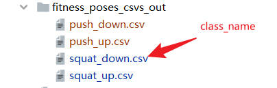
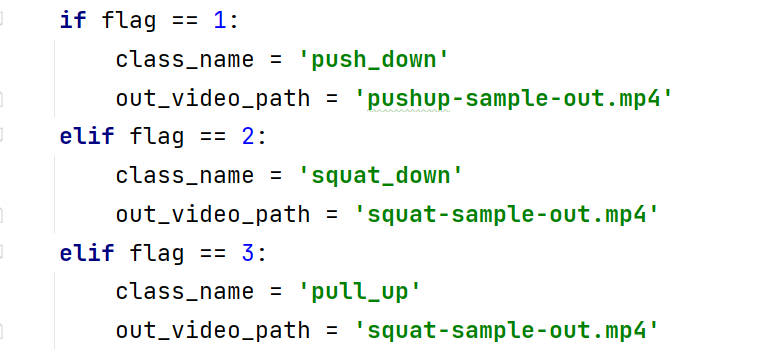
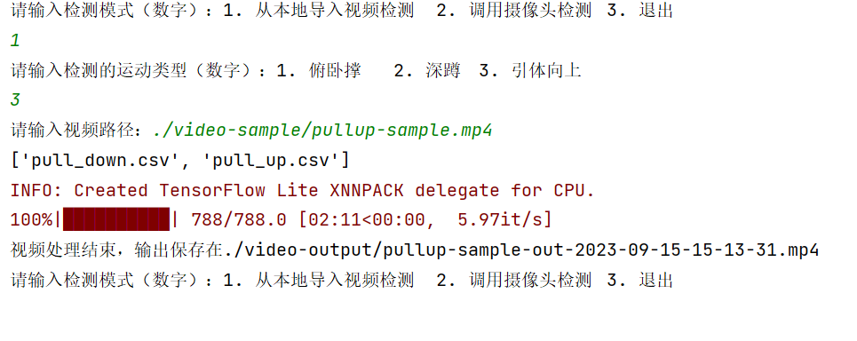

效果展示：

深蹲：


俯卧撑：


本项目的测试环境：win10，python3.7，mediapipe0.8.10，pycharm

<font color='#fc5531'>功能：由于使用的是KNN算法而不是根据各个运动的特点计算骨骼之间的角度来判断动作是否完成，因此本项目可以直接计数引体向上、深蹲和俯卧撑这几种健身运动而几乎无需修改代码，只需要输入视频或调用摄像头时选择一下是哪个运动即可，非常滴好用。</font>

各模块和文件介绍：

​		poseembedding.py是人体关键点归一化编码模块

​		poseclassifier.py是人体姿态分类模块，使用的算法是k-NN

​		resultsmooth.py是分类结果平滑模块，使用的是指数移动平均

​		counter.py是运动计数模块

​		visualizer.py是分类结果可视化模块

​		extracttrainingsetkeypoint.py是提取和处理训练集关键点模块，并将特征向量存储在csv文件中

​		trainingsetprocess.py是输入训练样本生成训练集以及训练集的检验校正的模块，里面说明了训练样本文件夹的要求

​		videoprocess.py是检测视频并计数动作的的模块（注意class_name参数的含义）

​		videocapture.py是调用摄像头实时检测并计数动作的模块（注意class_name参数的含义）

​		main.py是整个项目运行的入口程序

​		Roboto-Regular是visualizer.py中需要用到的字体文件

​		video-sample中的squat-sample.mp4和pushup-sample.mp4是样本视频，当然你也可以换成你自己做深蹲或俯卧撑的测试视频，在videoprocess.py中把video_path换成您的视频路径即可，需要注意的是本项目使用cv2处理视频帧，<font color='#fc5531'>cv2要求路径不能有中文</font>，并且路径应使用“\\\”。

​		视频输出在video-output文件夹里

​		<font color='#fc5531'>fitness_poses_csvs_out文件夹里面的csv文件就是使用拍摄的训练样本提取出来的深蹲和俯卧撑的训练集文件，有了该文件后就可以直接运行本项目。当然，如果你想体验自己动手的快乐，可以自己拍摄训练样本并把它放到`fitness_poses_images_in`（存放样本图片的文件夹最好取这个名字省得去改代码）文件夹中，然后删掉`fitness_poses_csvs_out`文件夹中对应运动的两个csv文件，这两个csv文件丢失后程序会自动加载样本图片进行特征提取然后重新生成csv文件。尤其要注意的是训练样本的路径不能有中文，否则opencvc会报奇奇怪怪的错误。</font>

<font color='#fc5531'>训练样本是该运动的两种状态的图片，理论上每个状态大约有几百个样本（例如，俯卧撑和深蹲的“向上”和“向下”位置），收集的样本涵盖不同的摄像机角度、环境条件、身体形状和运动变化，能做到这样最好。但实际中如果嫌麻烦的话每种状态15-25张左右都可以，然后要注意拍摄角度多样化，最好每隔15度拍摄一张。</font>

```python
训练样本图片文件夹结构
|---fitness_poses_images_in
	|---squat_down
    	-001.jpg
        -002.jpg
        ...
    |---squat_up
    	-001.jpg
        -002.jpg
        ...
```

由于我们选择了简单易上手的k-最近邻算法(k-NN) 作为分类器（该算法根据训练集中最接近的样本确定对象的类别），而不是根据各运动的肢体之间的夹角特点作为分类依据，所以该方法具有良好的泛化通用能力，可以广泛应用在诸如深蹲（deep squat）、俯卧撑（push up）、引体向上（pull up）等健身运动的计数上，您只需要输入视频即可（或者如果您想使用自己采集的样本，只需要将训练样本图片更换成对应的运动即可）。

<font color='#fc5531'>`class_name`需要与你的训练样本的两个动作状态图像文件夹的名字中的一个（或者是与fitness_poses_csvs_out中的一个csv文件的名字）保持一致，它后面将用于分类时的索引。
具体是哪个动作文件夹的名字取决于你的运动是什么，例如：如果是深蹲（俯卧撑），明显比较重要的判断计数动作是蹲下去（向下撑）；如果是引体向上，则判断计数的动作是向上拉到最高点的那个动作。</font>

```python
csv文件
|---fitness_poses_csvs_out
	|---push_down.csv
    |---push_up.csv
	|---squat_down.csv
    |---squat_up.csv
```

以深蹲为例




所以代码中`class_name`为

```python
    if flag == 1:
        class_name = 'push_down'
        out_video_path = 'pushup-sample-out.mp4'
    elif flag == 2:
        class_name = 'squat_down'
        out_video_path = 'squat-sample-out.mp4'
    elif flag == 3:
        class_name = 'pull_up'
        out_video_path = 'squat-sample-out.mp4'
```





运行结果：





详细的说明可参考：https://blog.csdn.net/m0_57110410/article/details/125569971